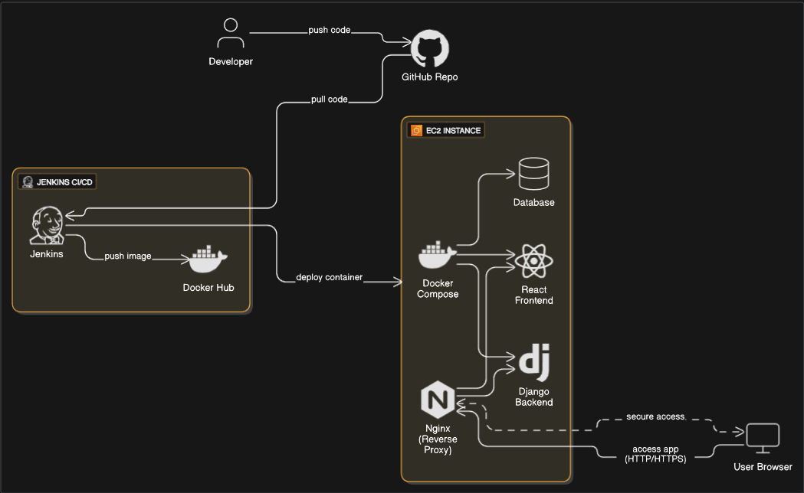

# 🚀 CI/CD Pipeline for Full-stack Notes App using Jenkins & Docker

This project demonstrates an end-to-end CI/CD pipeline for a full-stack Django + React Notes App.  
As part of  DevOps project, I containerized the application using Docker, automated builds and deployments using Jenkins, and hosted the app on an AWS EC2 instance (t2.micro).
The app runs on port 8000, with optional reverse proxy via NGINX.

---

## 🧰 Tech Stack

- Frontend: React  
- Backend: Django  
- Containerization: Docker  
- CI/CD: Jenkins  
- Image Hosting: Docker Hub  
- Web Server : NGINX  
- Cloud Provider: AWS EC2 (t2.micro)  
- Deployment Port: 8000  

---

## 📦 Requirements

- Python 3.9  
- Node.js  
- Docker & Docker Hub account  
- Jenkins (installed locally or on AWS EC2)  
- GitHub repository for source code  
-  NGINX for reverse proxy  
- AWS EC2 instance (Ubuntu, t2.micro)  

---

## ✅ What’s Implemented

- 🐳 Dockerfile for containerizing the Django-based full-stack app  
- 🔄 Jenkins CI/CD pipeline that:  
  - Pulls source code from GitHub  
  - Builds the Docker image  
  - Pushes the image to Docker Hub  
  - Runs the container on AWS EC2 (port 8000)  
- 🌐 App exposed via: `http: your ip address/:8000`  
- 🌍 * NGINX reverse proxy for domain-based access  

--
📂 Project Structure
.
├── api/                       # Django app (backend API)
├── mynotes/                  # React app (frontend)
├── notesapp/                 # Django project files
├── staticfiles/              # Collected static assets
├── nginx/                    # NGINX configuration 
├── Dockerfile                # Backend Docker build file
├── docker-compose.yml        # Compose file to run multi-container setup
├── Jenkinsfile               # Jenkins pipeline configuration
├── .env                      # Environment variables
├── requirements.txt          # Backend dependencies
├── manage.py                 # Django admin script
└── README.md                 # Project documentation

--
🎓 What You’ll Learn

- How to containerize a full-stack Django + React app using Docker

-Running multi-container applications with Docker Compose
- Building CI/CD pipelines with Jenkins
- Using Docker Hub for image hosting
-Setting up automated pipelines connected to GitHub
- Deploying web apps on AWS EC2 instances
- Using NGINX as a reverse proxy for custom domain mapping

--
🧪 How to Run Locally
1. Clone the repository
```
git clone https://github.com/LondheShubham153/django-notes-app.git
```

2. Build the app
```
docker build -t notes-app .
```

3. Run the app
```
docker run -d -p 8000:8000 notes-app:latest
```
--
CI/CD Pipeline Diagram:


--

📣 Feedback
If you found this project helpful or have suggestions for improvement, feel free to:

⭐ Star the repo

📬 Open an issue

🛠️ Submit a pull request

💬 Reach out to me on LinkedIn or Email


